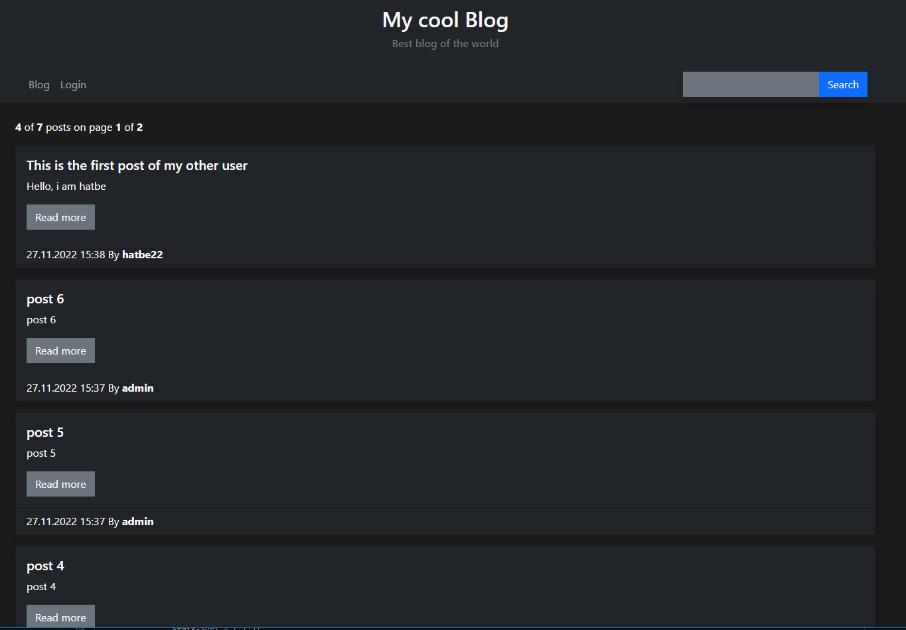

## Links:
- Youtube: https://www.youtube.com/watch?v=I52OLwLcpXc
 
 ## Key Features

- **CRUD Functionality**: Ability to Create, Read, Update, and Delete posts.
- **Markdown Support**: Enhanced content formatting with Markdown.
- **User Management**: Comprehensive user management system.
- **Installation Process**: Simplified installer for easy setup.
- **Authentication System**: Secure login and registration features.

## Application Architecture

This blog application is built using the LAMP stack, combining Linux, Apache, MySQL, and PHP. The application is developed in PHP, utilizing a MySQL database for data storage. Uniquely, it is constructed entirely from scratch, without relying on any frameworks. For styling, the Bootstrap CSS Framework is used. To parse Markdown, i used the library "Parsedown".

The complete source code is accessible on GitHub, encouraging review and collaborative enhancements. Additionally, an in-depth tutorial is available on YouTube.

## Detailed Features

### Index Page

- **Post Display**: All posts are displayed on the index page, with pagination for easy navigation.
- **Interaction Options**: Users can read more about a post, and if logged in, edit or delete it.

If not logged in:



If logged in:


### Search Functionality

- **Robust Search**: A search bar in the header allows users to search by author, title, or full text of blog posts.
- **Filtered Results**: Displays filtered content similar to the index page based on search criteria.


### Login

- **User Authentication**: Users with an account can log in using their username and password.


### View Post

- **Content Rendering**: On the single post page, users see the rendered Markdown blog post, along with details like author, posting date, and title.
- **Post Management**: Logged-in users have the option to delete or edit the post.


### Create Post

- **Post Creation**: Logged-in users can create new posts, choosing a suitable title and crafting content in plain text or Markdown.

### Edit Post

- **Content Editing**: Logged-in users can edit any post, working directly with the raw Markdown code.


### User Management

- **Administration Tools**: Provides an interface for managing users, including editing or deleting users (except for themselves), and registering new users.


### Create User

- **User Registration**: Logged-in users can add new users through a simplified form, mirroring the login interface for consistency.

### Installation Guide

1. Install a LAMP Server.
2. Create a MySQL Database.
3. Clone the GitHub repository.
4. Set up a virtual host.
5. Access the URL for configuration.


---

For further insights and a deeper understanding of this web application, please refer to the detailed YouTube video tutorial, explore the live demo, or examine the source code on GitHub.

Youtube Video: https://www.youtube.com/watch?v=I52OLwLcpXc

# Installation

Base OS: Ubuntu-server 20.04

## LAMP

``` bash
$ sudo apt update
```

As the Webserver, a Apache2 is used.

``` bash
$ sudo apt install apache2
```

As the Database server, a MariaDB is used.

``` bash
$ sudo apt install mariadb-server
$ sudo mariadb-secure-installation
Enter current password for root (enter for none): ENTER
Switch to unix_socket authentication [Y/n]: N
Change the root password? [Y/n] N
Remove anonymous users? [Y/n] Y
Disallow root login remotely? [Y/n] Y
Remove test database and access to it? [Y/n] Y
Reload privilege tables now? [Y/n] Y
```  

PHP Installation.

``` bash
$ sudo apt install php libapache2-mod-php php-mysql
```

Now we can prepare the System.

``` bash
$ sudo systemctl reload apache2
```

## Install the Blog

Create the Database.

``` bash
$ sudo mysql -u root -p
```

``` SQL
CREATE DATABASE blog;
CREATE USER bloguser IDENTIFIED BY 'password';
GRANT ALL PRIVILEGES ON blog.* TO bloguser;
EXIT;
```

``` bash
$ cd /var/www/html
$ sudo rm index.html
$ sudo git clone https://github.com/HATBE/Blog.git .
$ sudo chmod 755 /var/www/html -R
$ sudo chown www-data:www-data /var/www/html -R
$ sudo nano /etc/apache2/sites-available/000-default.conf
change -> DocumentRoot from "/var/www/html" to " /var/www/html/public"
Add: 
-- <Directory /var/www/html/public>
--        AllowOverride All
--</Directory>
sudo a2enmod rewrite
$ sudo systemctl reload apache2
```

Now, you can navigate to https://<ip/host> in your browser.

Follow the instructions of the installer.

Standard credentials:
Username: admin
Password: 1234

---
